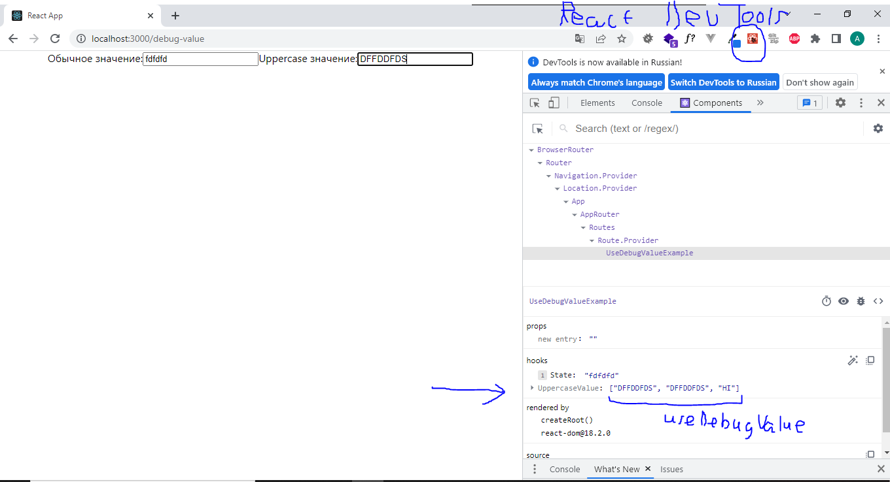

useDebugValue служит для отображения дополнительной информации напротив кастомных хуков в [React DevTools](https://chrome.google.com/webstore/detail/react-developer-tools/fmkadmapgofadopljbjfkapdkoienihi)
1. без useDebugValue
   
      
   
2. c useDebugValue
   
   

useDebugValue можно вызывать несколько раз, тогда значения будут в массиве.
```typescript jsx
useDebugValue(value)
useDebugValue(value,v=>longFormatting(v))
useDebugValue('Hi')
```


Если значение передаваемое в useDebugValue вычисляется долго, то это может приводить к фризам интерфейса. Хотя React DevTools может быть даже не установлен.
Чтобы избежать фризов интерфейса, и вычислять значение только в React DevTools следует передать вторым параметром колбек.
```typescript jsx
useDebugValue(value,v=>longFormatting(v))
```

Использование useDebugValue вне кастомных хуков, ни к чему не приведёт.
```typescript jsx
const UseDebugValueExample:FC = ()=>{
    const [value, setValue] = useState('')
    const [upValue, setUpValue] = useUppercaseValue('')

    useDebugValue("не рабоатет вне хуков")

    return (
        <>
            <label htmlFor="usually">Обычное значение:</label>
            <input id='usually' value={value} onChange={(e)=>setValue(e.target.value)}/>
            <label htmlFor="up">Uppercase значение:</label>
            <input id='up' value={upValue} onChange={(e)=>setUpValue(e.target.value)}/>
        </>
    )
}
```
