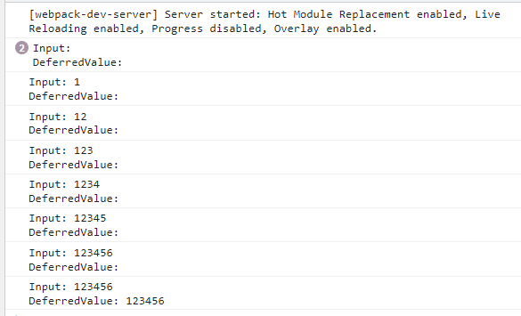

useDeferredValue - является аналог функции [debounce](https://learn.javascript.ru/task/debounce), которая возвращает значение c определённым интервалом (100 мс напрмиер), поэтому после первого возвращённого значение придётся ждать 100 мс до следующего.
Это удобно когда пользователь вводит текст, и мы не обновляем интерфейс после каждой введённой буквы, а ждём пока он введёт часть текста.
useDeferredValue помогает оптимизировать приложение, уменьшив количество не нужных обновлений интерфейса.

Введём в поле ввода: 123456
Пока мы вводим значения списка нет, но когда останавливаемся он появляется спустя некоторое время.
В консоли мы видим, что deferredValue остаётся неизменным пока input меняется от каждого введённого символа. И только спустя промежуток времени deferredValue копирует значение из input (и список начинает re-render).


Заменеим deferredValue на input, и ввёдём: 123456
Поле ввода становится не отзывчивым, в нём не отображаются введённые символы. Спусть некоторые время появляются символы и List.
```typescript jsx
const list = useMemo(()=>{
const l = []
for(let i=0;i<LIST_SIZE;i++){
l.push(<div key={i}>{input}</div>)
}
return (<>{l}</>);
},[input])
```
